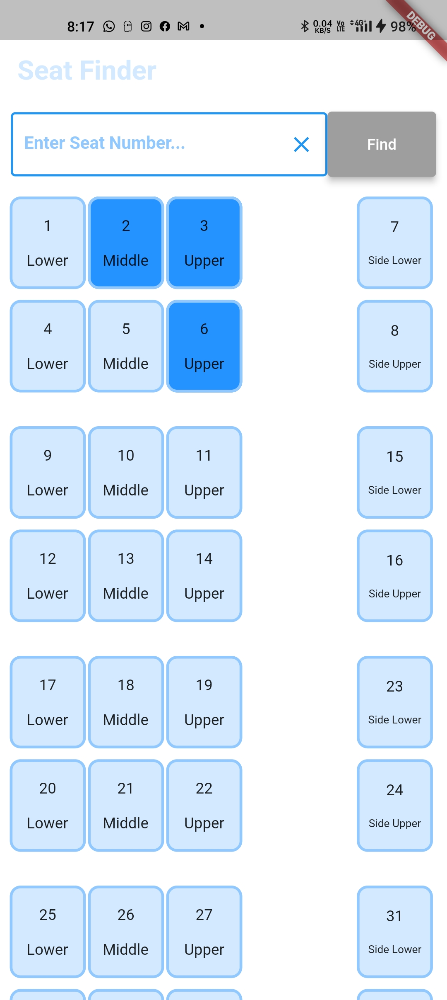
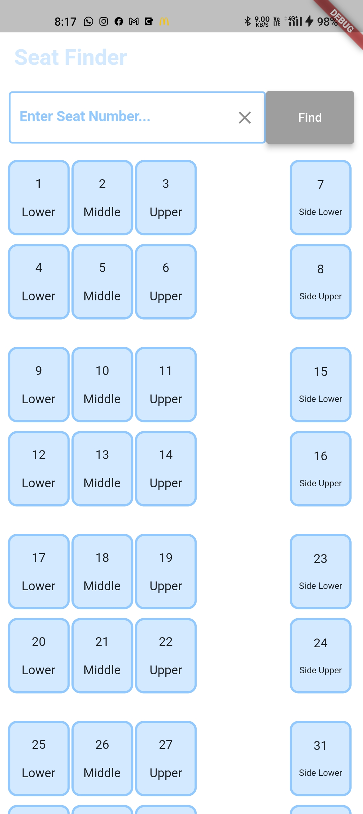

# seat_finder

A flutter assignment for the CRUV Flutter Developer opportunity

### Features:
- User can search for the particular seats
- Users can select and de-select the seats

### Screenshots

